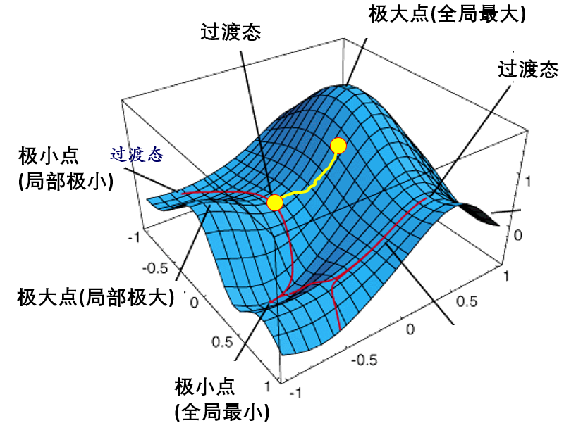

# NEB 搜索过渡态

---

## 理论计算方法

研究材料中的扩散一般有两种方法：过渡态理论（Transition State Theory，TST）和分子动力学（Molecular Dynamics，MD）。
当扩散的时间尺度超过了分子动力学模拟的限制（一般为纳秒级）时，使用过渡态理论来研究更为可行。

过渡态理论的一个关键问题是过渡态的搜索。
过渡态是最小能量路径（Minimum Energy Path，MEP）上能量最高的点，即一阶鞍点，如图所示：



在过渡态位置上，沿着反应路径是能量极大点，而在正交的其他所有方向上都是能量极小点。

---

## 过渡态搜索方法

目前流行的搜索方法是微动弹性带法（NEB）。
经过长时间的发展，形成了现在的准确性好、稳定性好的 CI-NEB 方法。

NEB 的基本思路如下：在初态和末态之间插入 P-1 个中间点结构，初态编号为 0，末态编号为 P，弛豫过程中每一步所有中间点结构一起运动。
中间点受到来自势能面的力和弹性带方向上的弹性力两个力的作用，当垂直于扩散路径方向的受力小于收敛标准时，即获得能量最小的路径。

NEB 计算的收敛性严重依赖于初末态的结构（特别是晶格常数）与能量，所以初末态结构优化时截断能和 k 点密度要尽可能大，而且先用 `ISIF=3`，再用 `ISIF=2` 确保优化到势能面上的局部极小点。

---

## 计算步骤

### 1. 优化初态和末态结构

建立两个文件夹 `ini/` 和 `fin/`，每个文件夹放入 VASP 计算必备的四个文件（INCAR（先用 ISIF=3，再用 ISIF=2）、POSCAR、KPOINTS、POTCAR），其中两个 POSCAR 分别对应未优化的初、末态。

注意确保两个文件夹里面除 POSCAR 外，其他文件完全一样，而且 POSCAR 中每行原子要一一对应。

结构优化完成后，用 `dist.pl ini/CONTCAR fin/CONTCAR` 检查优化后初、末态结构的相似程度（即初末态对应原子间距的平方和，再开根号）。
若返回值小于 5 Å，一般可以进行下一步；
如果数值非常大，一定要检查初末态 POSCAR 中原子顺序是否一一对应。

`dist.pl`以及后面涉及的脚本均来自[vtstscripts](https://theory.cm.utexas.edu/vtsttools/scripts.html)。

### 2. 插点

使用 `nebmake.pl ini/CONTCAR fin/CONTCAR N` 线性插 N 个点；
使用 `python idpp.py ini/CONTCAR fin/CONTCAR N` 非线性插 N 个点。

插点数 N 取决于前面 `dist.pl` 的返回值，一般取 `返回值/0.8` 即可。
CI-NEB 方法中能量最高的点可以自动爬坡，所以有的时候插一个点 CI-NEB 也可以精确地找到过渡态的位置，大多数时候 3 到 5 个点就能准确定位过渡态，是最有效率的寻找过渡态的方法之一。

以 N=3 为例，执行完命令后生成 `00/`、`01/`、`02/`、`03/`、`04/` 五个文件夹，内含 `nebmake.pl` 插点产生的 POSCAR 结构文件。

其中 `00/` 表示初态，里面放的是 `ini/CONTCAR`；`04/` 表示末态，放的是 `fin/CONTCAR`；`01/`、`02/`、`03/` 是插入的中间点。

然后记得把初、末态对应的 OUTCAR 复制到对应的文件夹中，供后续的数据分析用（要求 OUTCAR 电子步参数和 INCAR 电子步参数一致）。

另外， 

* 使用 `nebavoid.pl 1` 确保中间插入的点每一个原子间距都大于 1 Å，其中 `1` 表示最小的允许间距。

* 使用 `nebmovie.pl 0 或 1` 检查插入点的合理性，`0` 表示用 POSCAR 生成 xyz 文件，`1` 表示用 CONTCAR 生成。

如果 `nebmovie.pl` 没有直接生成 movie.xyz 可能是因为从官方主页下载的脚本默认不输出 movie.xyz。
此时需要自行修改 `nebmovie.pl` 文件，即注释掉脚本最后几行：
```
# if($xyzflag==0){
#   unlink "movie.xyz";
# }
```

### 3. 准备需要的其他文件

在当前目录下面放入 KPOINTS、POTCAR 及 INCAR 文件。
要求 KPOINTS 、 POTCAR 与 `ini/`、`fin/` 文件夹中的一样；INCAR 中的基本参数也与初、末态结构优化的 INCAR 保持一致
（注意计算精度：`EDIFF = 1E-7`、`EDIFFG = -0.03`）， 另外再加入 NEB 计算的相关参数，即：
```
IBRION = 3
POTIM = 0
IOPT = 1 | 7 # ISIF=3 时，必须设置 IOPT=3 或 7；
ICHAIN = 0 # 开启 NEB 方法，默认会打开，不写也行
LCLIMB = .T. # 开启 CI 方法，默认会打开，不写也行
SPRING = -5 # 弹簧力常数，默认就是 -5
IMAGES = N # 即为插入点的数量
NCORE = ? # NCORE*IMAGES 必须能被总核数整除，为保证最大的并行效率节点数最好等于插点数
LPLANE = .T.
```

若想使用 VTST 内置的优化算法，需要设置 `IOPT = 1 或 3 或 7`（其中 `1` 适合精收敛，`3` 和 `7` 适合粗收敛）、`IBRION = 3`、`POTIM = 0`。

若想使用 VASP 自带的优化器，可以使用 `IOPT = 0`、`IBRION = 1 或 3`（不能取 `IBRION = 2`），`POTIM = 0.1`（一般 `POTIM` 在 `0.01 ~ 0.5` 之间）。

在过渡态计算中可将力收敛参数设置得更小而能量精度设置得较宽，以保证精度的同时提高计算效率。

* 使用 NEB 找到过渡态之后，为了确保能量准确，不妨对每个点都 `cp CONTCAR POSCAR` 再算一遍静态自洽。

计算体系较大的结构时使用 `IOPT = 3`。`EDIFF` 参数非常关键！过渡态对力计算精度要求极高，更精准的电子步收敛（`1E-7`）会有更精准的力，可以加速收敛。

### 4. 后处理

计算过程中，可以用 `nebef.pl` 或 `nebefs.pl` 命令查看计算收敛情况。
输出中，第二列即为最大原子受力，第三列为相应结构的能量，第四列为相对初态的能量。
当所有插点的最大原子受力都 `< |EDIFFG|` 时，计算收敛。

也可以使用 `nebbarrier.pl` 来观察收敛情况，该命令会返回一个 `neb.dat` 文件。
`neb.dat` 文件第二列表示距离（即临近两结构的 `dist.pl` 的计算结果），第三列表示相对初态的能量，第四列为 neb 方向的受力（forces along the neb）。

计算完成后，使用命令 `nebresult.pl` 进行数据后处理。
`nebresult.pl` 会自动执行 `nebbarrier.pl`、`nebspline.pl`、`nebef.pl`、`nebmovie.pl`、`nebjmovie.pl`、`nebconverge.pl`脚本，
还会对各文件夹中的 OUTCAR 打包压缩（压缩文件使用 `gunzip 0*/OUTCAR.gz` 解压）。

其中 `mep.eps`（可用 EPS/PS viewer 打开）是以 `dist.pl` 距离为横坐标，能量为纵坐标画出的势垒图（也可以使用 `spline.dat` 自行绘图）。

生成的 `vaspgr` 文件夹内是各个插点结构的收敛图，例如 `vaspout1.eps` 是 `01/` 结构收敛信息。

## 求扩散系数

---

得到迁移势垒之后，根据阿伦尼乌斯方程

$$
D = l^2 v e^{-\frac{E}{k_B T}}
$$

求出原子或离子的扩散系数，其中 $l$ 是初末态原子间距，$v$ 是振动频率，$E$ 是迁移势垒。

基于 C. Wert 和 C. Zener 所提出的理论，$v$ 可以近似表示为

$$
v = \sqrt{\frac{2E_a}{ml^2}}
$$

，式中 $m$ 是原子质量。

除此之外，扩散系数还可以使用分子动力学模拟得到，基本公式如下：

$$
D = \frac{1}{6} \lim_{t \to \infty} \frac{MSD(t)}{t}
$$

